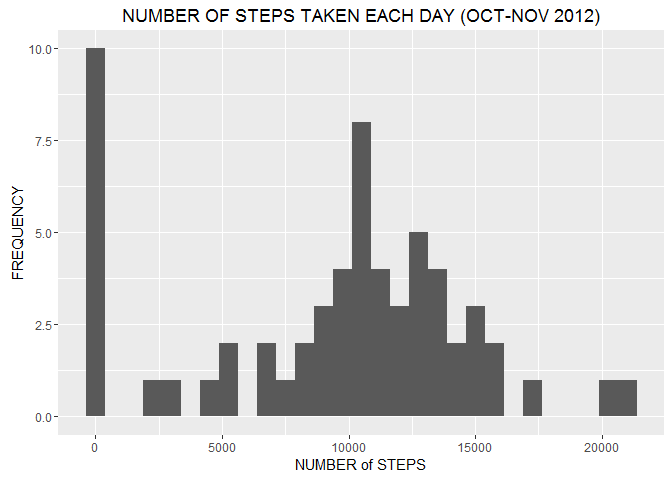
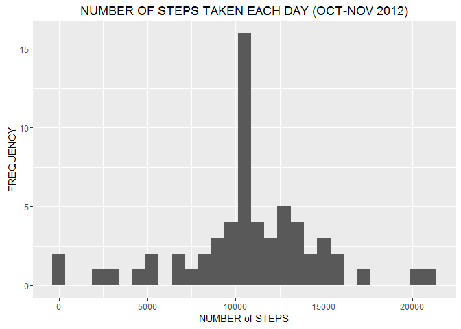

# Reproducible Research: Peer Assessment 1


Loading and Processing the Data
================================


```r
knitr::opts_chunk$set(echo = TRUE)

library(ggplot2)
```

```
## Warning: package 'ggplot2' was built under R version 3.3.1
```

```r
##Setting up a directory, dowloading and unzipping the file
setwd("~/r.PROJECTS/R_dir") 
if(!file.exists("./DSCourse_5_Assignment_1")) dir.create("./DSCourse_5_Assignment_1")
setwd("~/r.PROJECTS/R_dir/DSCourse_5_Assignment_1")
fileUrl <- ("https://d396qusza40orc.cloudfront.net/repdata%2Fdata%2Factivity.zip")
download.file(fileUrl, destfile = "project_data.zip")
unZip <- unzip("project_data.zip")

##read in "activity_data"
activity_data <- read.csv("activity.csv")
```

What is mean total number of steps taken per day?
====================================================


```r
knitr::opts_chunk$set(echo = TRUE)

##sorting "activity_data"
total_steps <- tapply(activity_data$steps, activity_data$date, FUN = sum, na.rm = TRUE)

##Histogram PLOT (total steps)
qplot(total_steps, binwidth = 750, xlab = "NUMBER of STEPS", 
                                   ylab = "FREQUENCY") + ggtitle("NUMBER OF STEPS TAKEN EACH DAY (OCT-NOV 2012)")
```

<!-- -->

```r
##Mean and Median (total steps)
mean(total_steps, na.rm = TRUE)
```

```
## [1] 9354.23
```

```r
median(total_steps, na.rm = TRUE)
```

```
## [1] 10395
```

What is the average daily activity pattern?
============================================


```r
knitr::opts_chunk$set(echo = TRUE)

#Average Daily Activity Pattern
avg_activity_pattern <- aggregate(x = list(steps = activity_data$steps), 
                                 by = list(interval = activity_data$interval),
                                FUN = mean, na.rm = TRUE)
      
##Line Plot (avg activity)
ggplot(data = avg_activity_pattern, 
      aes(x = interval, y = steps)) + geom_line() + 
                                      xlab("5 MINUTE INTERVAL") + 
                                      ylab("NUMBER OF STEPS") + ggtitle("AVERAGE DAILY ACTIVE PATTERN")
```

<!-- -->

```r
##maximum number of steps (5 minute interval)
avg_activity_pattern[which.max(avg_activity_pattern$steps),]
```

```
##     interval    steps
## 104      835 206.1698
```

Imputing missing values
========================


```r
#IMPUTING MISSING VALUES
missing_values <- is.na(activity_data$steps)

table(missing_values)
```

```
## missing_values
## FALSE  TRUE 
## 15264  2304
```

```r
##Replacing the Missing Values with a Mean Value
mean_fill_value <- function(steps, interval) {
      mean_fill <- NA
  if (!is.na(steps))
    mean_fill <- c(steps)
  else
    mean_fill <- (avg_activity_pattern[avg_activity_pattern$interval==interval, "steps"])
  return(mean_fill)
}
mean_data_final <- activity_data
mean_data_final$steps <- mapply(mean_fill_value, mean_data_final$steps, mean_data_final$interval)
total_steps_2 <- tapply(mean_data_final$steps, mean_data_final$date, FUN = sum)

##Histogram PLOT2 (with missing values)
qplot(total_steps_2, binwidth = 750, xlab = "NUMBER of STEPS", 
                                     ylab = "FREQUENCY") + ggtitle("NUMBER OF STEPS TAKEN EACH DAY (OCT-NOV 2012)")
```

<!-- -->

```r
##Mean and Median (total steps)
mean(total_steps_2, na.rm = TRUE)
```

```
## [1] 10766.19
```

```r
median(total_steps_2, na.rm = TRUE)
```

```
## [1] 10766.19
```

Are there differences in activity patterns between weekdays and weekends?
==========================================================================


```r
#Activity Pattern Differences (Weekday vs Weekend)
weekday_vs_weekend <- function(date) {
               day <- weekdays(date)
  if (day %in% c("Monday", "Tuesday", "Wednesday", "Thursday", "Friday"))
    return("weekday")
  else if (day %in% c("Saturday", "Sunday"))
    return("weekend")
  else
    stop("invalid date")
}
mean_data_final$date <- as.Date(mean_data_final$date)
mean_data_final$day <- sapply(mean_data_final$date, FUN=weekday_vs_weekend)
avg_weekday_vs_weekend <- aggregate(steps ~ interval + day, data = mean_data_final, mean)

##Line Plot2 (weekday vs weekend)
ggplot(data = avg_weekday_vs_weekend, 
       aes(x = interval, y = steps)) + geom_line() + 
                               facet_grid(day ~ .) +
                               xlab("5 MINUTE INTERVAL") + 
                               ylab("NUMBER OF STEPS") + ggtitle("WEEKDAY vs WEEKEND (average number of steps)")
```

<!-- -->
